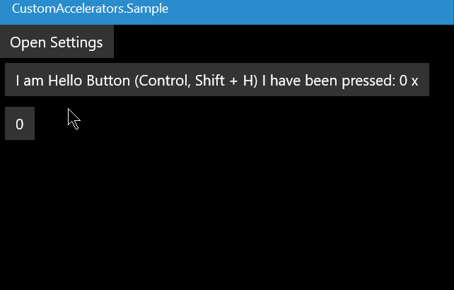

# Custom Accelerators

Library and XAML control for keyboard shortcuts customization.



See it in live action ([Video Detail Player](https://www.microsoft.com/en-us/p/video-detail-player/9p34ghb2h88r))

## Usage

(See the sample project in this repo for details)

- Add the package to your UWP project:
[](https://www.nuget.org/packages/CustomAccelerators/)
  > Install-Package CustomAccelerators

- Add reference in XAML:

    ``` xml
    <Page
    ...
    xmlns:ca="using:CustomAccelerators">
    ```

- Add custom accelerator under your button, specify `Identity`

    ``` xml
    <Button Content="Hello" >
        <Button.KeyboardAccelerators>
            <ca:CustomAccelerator  Identity="HelloCa"/>
        </Button.KeyboardAccelerators>
    </Button>
    ```

- Add definitions of accelerators somewhere (e.g. in ctor of the Page).

```csharp
var acceleratorsList = new List<(string identity, string label, VirtualKey key, VirtualKeyModifiers modifiers)>()
{
    ("HelloCa","I am Hello Button",VirtualKey.H,VirtualKeyModifiers.Control|VirtualKeyModifiers.Shift),
    ("Another Accelerator","",VirtualKey.PageDown,VirtualKeyModifiers.None)
};

AcceleratorsManager.AddDefaultsAndLoadFromStorage(acceleratorsList);
```

- Add `CustomAcceleratorsEditControl` somewhere in your xaml.

```xml
<ca:CustomAcceleratorsEditControl />
```

## Notes

- It does save the shortcuts persistently (using local settings).
- You can't edit the appearance of `CustomAcceleratorsEditControl` (yet).
- Dont't set `Key`, `Modifiers` or `Label` in xaml. Only within definition.
- It doesn't check if there are more action with same shortcut. In such case, just one action will be invoked.

